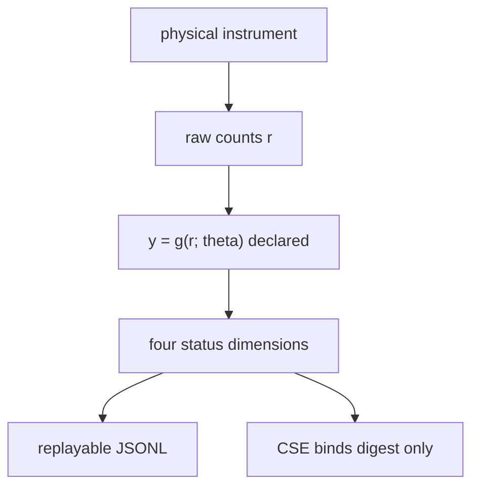

# Map

```mermaid
flowchart TD
  Phys["physical instrument"] --> Raw["raw counts r"]
  Raw --> G["y = g(r; theta) declared"]
  G --> Qual["four status dimensions"]
  Qual --> Log["replayable JSONL"]
  Qual --> CSE["CSE binds digest only"]
```

Caption: conversion is declared, not inferred. Simulated counts are not an
LVDT. A bound digest is not a millimetre of a beam. JSPT is not imported.
Firmware stays C when it exists.
